# Plataforma de Diagnóstico - UES Virtual

## Objetivos

La Plataforma de Diagnóstico está pensada para los siguientes objetivos:

* Crear exámenes y aplicarlos a aspirantes
* Evaluar y generar reportes de conocimientos de los aspirantes
* Solicitar documentación para entrar a una universidad virtual

## Instalación

Clonamos el repositorio:

```shell
cd /var/www/
git clone git@bitbucket.org:ues-virtual/plataforma-diagnostico.git
cd plataforma-diagnostico
```

Copiamos el archivo de entorno de ejemplo y editamos los parámetros con los que instalaremos la plataforma:

```shell
cp .env.example .env
nano .env
```

Levantamos los servicios usando `docker-compose`:

```shell
docker-compose build && docker-compose up -d
```

Creamos al súper usuario:

```shell
docker exec -it ues_diagnostico_v2_django python manage.py createsuperuser
```

Y añadimos a nginx la configuración que se encuentra en [nginx.conf](./conf/nginx.conf):

```
# ...

location /diagnostico {
  proxy_redirect off;
  proxy_set_header Host $host;
  proxy_set_header X-Real-IP $remote_addr;
  proxy_set_header X-Forwared-For $proxy_add_x_forwarded_for;
  proxy_intercept_errors on;
  proxy_pass http://127.0.0.1:8888;
}

location /diagnostico/media {
  alias /var/www/plataforma-diagnostico/diagnostico_project/media;
}

location /diagnostico/static {
  alias /var/www/plataforma-diagnostico/diagnostico_project/staticfiles;
}

# ...
```

Es importante se utilice exactamente el nombre **diagnostico** como location.

## Actualización

Para actualizar, sólo hay que ejecutar los siguientes comandos:

```shell
cd plataforma-diagnostico
git fetch && git pull
docker-compose restart
```

## Manual de uso

Antes de enviar los correos de registro, tenemos que configurar la plataforma. El proyecto ya cuenta con una configuración predeterminada, se puede cargar ejecutando los scripts correspondientes.

Para cargar el examen por defecto:

```shell
docker exec -it ues_diagnostico_v2_db psql -U diagnostico -W -d diagnostico -a -f ./scripts/default_config_exam.sql
```

Para cargar la configuración por defecto (preguntas frecuentes y categorías de documentos):

```shell
docker exec -it ues_diagnostico_v2_db psql -U diagnostico -W -d diagnostico -a -f ./scripts/default_config.sql
```

Si se cargó la configuración por defecto, podemos **saltarnos al paso número 3**.

**1. Crea un nuevo examen**

Ve a ``https://<dirección>/admin``, entra como súper usuario y crea un examen desde la interface:

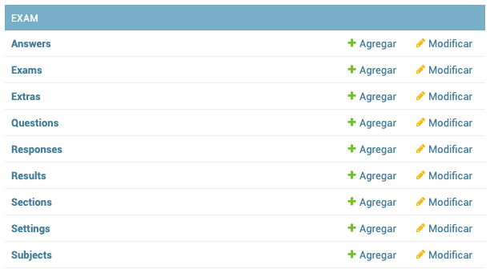

La jerarquía de datos es la siguiente:

```
+---------------------+
|        Exam         |
+----------+----------+
           |
           v
+----------+----------+
|       Subject       |
+----------+----------+
           |
           v
+----------+----------+          +---------------------+
|       Section       +<---------+        Extra        |
+----------+----------+          +---------------------+
           |
           v
+----------+----------+
|      Question       |
+----------+----------+
           |
           v
+----------+----------+
|       Answer        |
+---------------------+
```

También debemos de tener una instancia del modelo ``Settings`` para configurar **el examen configurado y su duración**:

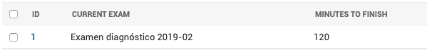

Los datos que responden los usuarios se capturan en ``Responses``, ¡no se debe de modificar!

**2. Decidir cuáles documentos se van a pedir**

Para cargar a la plataforma los documentos, nuevamente tenemos que ir a ``https://<dirección>/admin``, y luego dirigirnos a la sección de documentos:

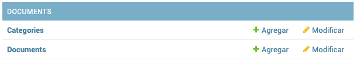

Y agregamos los tipos de documentos que necesitemos en ``Categories``:

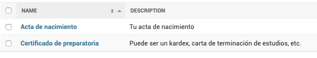

Los archivos que suben los usuarios se guardan en ``Documents``. Nuevamente, no debemos de editar esta parte.

**3. Registrar a los usuarios**

La plataforma puede parsear un reporte generado por la plataforma de Control Escolar en formato .csv, un ejemplo de este documento puede verse en [docs/registro_ejemplo.csv](docs/registro_ejemplo.csv). En el ejemplo anterior, el usuario registrado sería el número `200000000`.

Para cargar el documento tenemos que ir a la sección de `Aspirantes` que se encuentra en `Users`:

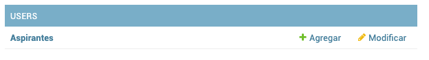

Y dentro de esa sección, hacer click en el enlace que dice "Import CSV":

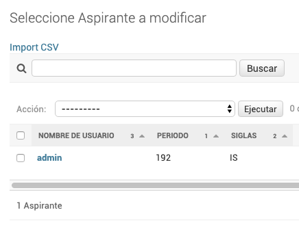

Si todo está en orden, se deberían de listar en esa misma sección:

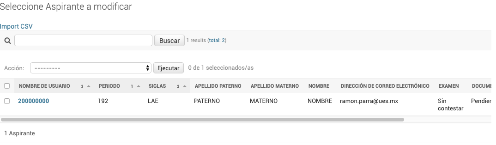

Cuando importamos el CSV, **sólo se cargarán los aspirantes en la plataforma, no podrán entrar**. Para darles acceso, habrá que **seleccionarlos** y realizar la acción "Send registration email":

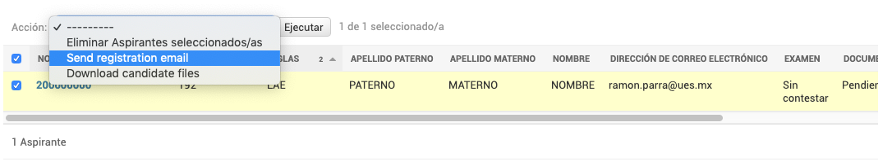

Esto los contactará por correo, y les generará una contraseña aleatoria:

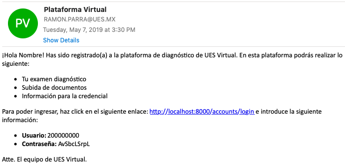

Hay que recordar que la plataforma sólo lleva registro de **si se les intentó enviar un correo o no**, no de si llegó de verdad. Por lo que es recomendable **ver la bandeja de salida del correo configurado** para verificar que sí se haya enviado correctamente.

También hay que tener en cuenta que, debido a limitaciones de proveedores de correo, no es recomendable dar de alta a todos los alumnos en una sola instancia, sino darlos de alta **en grupos de 50**.

**4. Descargar el reporte del examen** 

Para descargar el reporte del examen, tenemos que dirigirnos a la sección de `Aspirantes`, y realizar la acción "Generate general report":

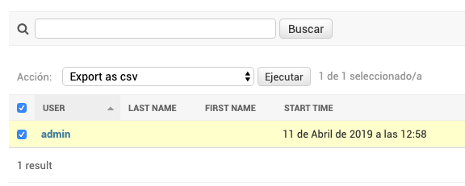

**5. Descargar archivos subidos**

Nuevamente en la sección de `Aspirantes`, debemos seleccionar aquellos de los que queramos descargar los archivos, y realizamos la acción "Download candidate files":

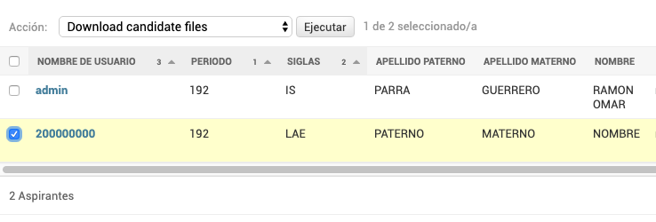

Esto descargará un archivo .zip, el cual contendrá los archivos separados por el número de aspirante. En caso de que se seleccionen muchos aspirantes, habrá que **esperar un rato mientras el sistema prepara el archivo**. Para evitar la espera, podemos filtrar usando el menú de la derecha a los candidatos y sólo descargar aquellos en los que estemos interesados.